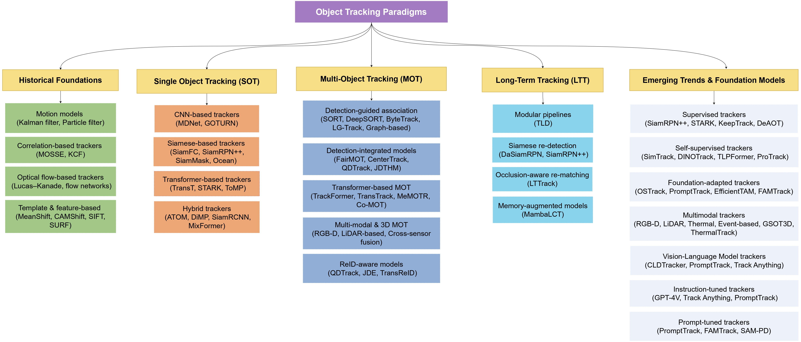
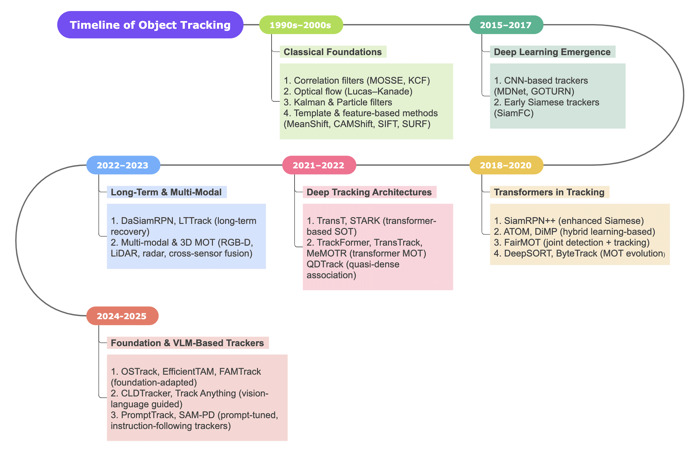

# Object Tracking: A Comprehensive Survey From Classical Approaches to Large Vision-Language and Foundation Models


[](https://opensource.org/licenses/MIT)  [](https://github.com/rahulrj/Awesome-Object-Tracking)
[]() [](https://awesome.re)

<p align="center">
    
</p>


Welcome to the **Awesome-Object-Tracking** repository!  
This repository is a curated collection of the most influential **papers**, **code implementations**, **benchmarks**, and **resources** related to **Object Tracking** across **Single Object Tracking (SOT)**, **Multi-Object Tracking (MOT)**, **Long-Term Tracking (LTT)**, and **Foundation Model–based Tracking**.  

Our work is based on the following paper:  
📄 **Object Tracking: A Comprehensive Survey From Classical Approaches to Large Vision-Language and Foundation Models**   
Available on [ResearchGate](https://www.researchgate.net/publication/395893646_Object_Tracking_A_Comprehensive_Survey_From_Classical_Approaches_to_Large_Vision-Language_and_Foundation_Models), [Preprints](https://www.preprints.org/manuscript/202509.2051/v1)


#### Authors
[Rahul Raja](https://www.linkedin.com/in/rahulraja963/) - Linkedin, Carnegie Mellon University([50 citations](https://scholar.google.com/citations?hl=en&user=fLloCIEAAAAJ))  
[Arpita Vats](https://www.linkedin.com/in/arpita-v-0a14a422/) - Linkedin, Boston University, Santa Clara University([190 citations](https://scholar.google.com/citations?user=6s2eRbIAAAAJ&hl=en))  
[Omkar Thawakar](https://omkarthawakar.github.io/index.html) - Mohamed bin Zayed University of Artificial Intelligence, Abu Dhabi, UAE([640 citations](https://scholar.google.com/citations?user=flvl5YQAAAAJ&hl=en))    
[Tajamul Ashraf](https://www.tajamulashraf.com) - Mohamed bin Zayed University of Artificial Intelligence, Abu Dhabi, UAE([100 citations](https://scholar.google.com/citations?user=n6fSkQ4AAAAJ&hl=en))  


Feel free to ⭐ star and fork this repository to keep up with the latest advancements and contribute to the community.

If our work has been of assistance to you, please feel free to cite our survey. Thank you.
```
@article{202509.2051,
	doi = {10.20944/preprints202509.2051.v1},
	url = {https://doi.org/10.20944/preprints202509.2051.v1},
	year = 2025,
	month = {September},
	publisher = {Preprints},
	author = {Rahul Raja and Arpita Vats and Omkar Thawakar and Tajamul Ashraf},
	title = {Object Tracking: A Comprehensive Survey From Classical Approaches to Large Vision-Language and Foundation Models},
	journal = {Preprints}
}
```

---
<p align="center">
  
<!--    -->
</p>
Taxonomy of object tracking paradigms, spanning historical foundations, single-object tracking (SOT), multi-object tracking (MOT), long-term tracking (LTT), and emerging trends leveraging foundation and vision-language models. Each branch highlights representative methods and architectures across the evolution of tracking research.

---
<p align="center">
  
<!--    -->
</p>
Timeline of object tracking research from classical foundations and deep learning, through hybrid and transformer-based
trackers, to recent long-term, multi-modal, and foundation/VLM-powered approaches.

---

# 📚 Object Tracking Surveys  

| Title | Task | Publication Date | Link |
|---------------------------------|------|----------------|---------------------------------|
| Object Tracking: A Comprehensive Survey From Classical Approaches to Large Vision-Language and Foundation Models | SOT/MOT/VLM | 2025 | [Preprints](https://www.preprints.org/manuscript/202509.2051/v1) |
| Deep Learning-Based Multi-Object Tracking: A Comprehensive Survey from Foundations to State-of-the-Art | MOT | 2025 | [Arxiv](https://arxiv.org/abs/2506.13457) |
| Multiple object tracking: A literature review | MOT | 2023 | [ScienceDirect](https://www.sciencedirect.com/science/article/pii/S0004370220301958) |
| Transformers in Single Object Tracking: An Experimental Survey | SOT | 2023 | [Arxiv](https://arxiv.org/abs/2302.11867) |
| Visual object tracking: A survey | MOT | 2022 | [ScienceDirect](https://www.sciencedirect.com/science/article/abs/pii/S1077314222001011) |
| A Survey of Long-Term Visual Tracking | LTT | 2022 | [IEEE](https://ieeexplore.ieee.org/document/10292117) |
| Single Object Tracking: A Survey of Methods, Datasets, and Evaluation Metrics | MOT | 2022 | [Arxiv](https://arxiv.org/abs/2201.13066) |
| Deep Learning in Visual Object Tracking: A Review | SOT | 2021 | [IEEE](https://ieeexplore.ieee.org/document/9666461) |
| Deep Learning For Visual Tracking: A Comprehensive Survey | SOT | 2021 | [Arxiv](https://arxiv.org/abs/1912.00535) |
| Deep Learning for Generic Object Detection: A Survey | SOT/MOT | 2019 | [Springer](https://link.springer.com/article/10.1007/s11263-019-01247-4) |
| A Survey of Multiple Object Tracking | MOT | 2016 | [IEEE](https://ieeexplore.ieee.org/abstract/document/7832121) |
| Object tracking: A survey | SOT/MOT | 2006 | [ACM](https://dl.acm.org/doi/10.1145/1177352.1177355) |


## 📌 Single Object Tracking (SOT) Models

* MDNet: Multi-Domain Convolutional Network for Visual Tracking [[Paper]](https://openaccess.thecvf.com/content_cvpr_2016/papers/Nam_Learning_Multi-Domain_Convolutional_CVPR_2016_paper.pdf)   
* GOTURN: Learning to Track at 100 FPS with Deep Regression Networks [[Paper]](https://arxiv.org/abs/1604.01802)   
* TLD: Tracking-Learning-Detection [[Paper]](http://vision.stanford.edu/teaching/cs231b_spring1415/papers/Kalal-PAMI.pdf)   
* SiamFC: Fully Convolutional Siamese Networks for Object Tracking [[Paper]](https://arxiv.org/abs/1606.09549)   
* SiamRPN: High Performance Visual Tracking with Siamese Region Proposal Network [[Paper]](https://arxiv.org/abs/1808.06048)   
* SiamRPN++: Evolution of Siamese Visual Tracking with Very Deep Networks [[Paper]](https://arxiv.org/abs/1812.11703)   
* TransT: Transformer Tracking [[Paper]](https://arxiv.org/abs/2103.15436)   
* STARK: Learning Spatio-Temporal Transformer for Visual Tracking [[Paper]](https://arxiv.org/abs/2103.17154)   
* ToMP: Transformer-based Online Multiple-Template Prediction [[Paper]](https://openaccess.thecvf.com/content/CVPR2022/papers/Mayer_Transforming_Model_Prediction_for_Tracking_CVPR_2022_paper.pdf)   
* ATOM: Accurate Tracking by Overlap Maximization [[Paper]](https://arxiv.org/abs/1811.07628)   
* DiMP: Learning Discriminative Model Prediction for Tracking [[Paper]](https://arxiv.org/abs/1904.07220)   
* SiamRCNN: Target Tracking by Re-detection [[Paper]](https://arxiv.org/abs/1911.12836)   
* SiamBAN: Balanced Attention Network for Visual Tracking [[Paper]](https://arxiv.org/abs/2003.06761)   
* MixFormer: End-to-End Tracking with MixFormer [[Paper]](https://arxiv.org/abs/2203.11082)   

## 📌 Multi-Object Tracking (MOT) Models

### 🟦 Detection-Guided

* DeepSORT: Simple Online and Realtime Tracking with a Deep Association Metric [[Paper]](https://arxiv.org/abs/1703.07402)   
* StrongSORT: Strong Baselines for DeepSORT [[Paper]](https://arxiv.org/abs/2202.13514)   
* Tracktor++: Leveraging the Tracking-by-Detection Paradigm for Object Tracking [[Paper]](https://arxiv.org/abs/1903.05625)   
* ByteTrack: Multi-Object Tracking by Associating Every Detection Box [[Paper]](https://arxiv.org/abs/2110.06864)   
* MR2-ByteTrack: Multi-Resolution & Resource-Aware ByteTrack [[Paper]](https://openaccess.thecvf.com/content/CVPR2024W/EVW/papers/Bompani_Multi-resolution_Rescored_ByteTrack_for_Video_Object_Detection_on_Ultra-low-power_Embedded_CVPRW_2024_paper.pdf)   
* LG-Track: Local-Global Association Framework [[Paper]](https://arxiv.org/abs/2309.09765)   
* Deep LG-Track: Deep Local-Global MOT with Enhanced Features [[Paper]](https://arxiv.org/abs/2504.01457)   
* RTAT: Robust Two-Stage Association Tracker [[Paper]](https://arxiv.org/abs/2408.07344)   
* Wu et al. – ACCV MOT Framework [[Paper]](https://openaccess.thecvf.com/content/ACCV2022/html/Wu_Group_Guided_Data_Association_for_Multiple_Object_Tracking_ACCV_2022_paper.html)   

---

### 🟦 Detection-Integrated

* FairMOT: FairMOT: On the Fairness of Detection and Re-ID in MOT [[Paper]](https://arxiv.org/abs/2004.01888)   
* CenterTrack: Objects as Points for Tracking [[Paper]](https://arxiv.org/abs/2004.01177)   
* QDTrack: Quasi-Dense Similarity Learning for MOT [[Paper]](https://arxiv.org/abs/2006.06664)  
* Speed-FairMOT: Lightweight FairMOT for Real-Time Applications [[Paper]](https://link.springer.com/article/10.1007/s11760-025-04395-y)   
* TBDQ-Net: Tracking by Detection-Query Efficient Network [[Paper]](https://arxiv.org/abs/2411.06197)   
* JDTHM: Joint Detection-Tracking with Hierarchical Memory [[Paper]](https://www.mdpi.com/2076-3417/14/23/11098) )  

---

### 🟦 Transformer-Based

* TrackFormer: Tracking by Query with Transformer [[Paper]](https://arxiv.org/abs/2101.02702)   
* TransTrack: Transformer-based MOT with Cross-Frame Attention [[Paper]](https://arxiv.org/abs/2012.15460)   
* ABQ-Track: Anchor-Based Query Transformer for MOT [[Paper]](https://www.mdpi.com/1424-8220/24/1/229)   
* MeMOTR: Memory-Augmented Transformer for MOT [[Paper]](https://arxiv.org/abs/2307.15700)   
* Co-MOT: Collaborative Transformer for Multi-Object Tracking [[Paper]](https://arxiv.org/abs/2305.12724)   

---

### 🟦 Multi-Modal / 3D MOT

* DS-KCF: Depth-based Scale-adaptive KCF [[Paper]](https://doi.org/10.1007/s11554-016-0654-3)   
* OTR: Object Tracking by Reconstruction [[Paper]](https://openaccess.thecvf.com/content_CVPR_2019/html/Kart_Object_Tracking_by_Reconstruction_With_View-Specific_Discriminative_Correlation_Filters_CVPR_2019_paper.html)   
* DPANet: Depth-aware Panoptic Association Network [[Paper]](https://arxiv.org/abs/2405.10947)   
* AB3DMOT: Simple Baseline for 3D MOT [[Paper]](https://arxiv.org/abs/2008.08063)   
* CenterPoint: Center-based 3D Object Tracking [[Paper]](https://arxiv.org/abs/2006.11275) 
* RGB-D Tracking: Depth-Based Multi-Object Tracking [[Paper]](https://arxiv.org/abs/2003.08608)   
* CS Fusion: Multi-Modal 3D MOT with Cross-Sensor Fusion [[Paper]](https://arxiv.org/abs/2207.11952)     


---

### 🟦 ReID Aware Methods
* JDE: Joint Detection and Embedding for Real-Time MOT [[Paper]](https://arxiv.org/abs/1909.12605)   
* TransReID: Transformer-based Object Re-Identification [[Paper]](https://arxiv.org/abs/2102.04378) 

## 🔹 Long-Term Tracking (LTT) Models

* TLD: Tracking-Learning-Detection [[Paper]](http://vision.stanford.edu/teaching/cs231b_spring1415/papers/Kalal-PAMI.pdf)   
* DaSiamRPN: Distractor-Aware Siamese RPN for LTT [[Paper]](https://arxiv.org/abs/1808.06048)   
* SiamRPN++ (LT): Improved Siamese RPN with Global Search [[Paper]](https://arxiv.org/abs/1812.11703)   
* LTTrack: Occlusion-Aware Long-Term MOT with Zombie Pool Re-activation [[Paper]](https://ieeexplore.ieee.org/document/10536914)   
* MambaLCT: Memory-Augmented Long-Term Tracking with State-Space Models [[Paper]](https://arxiv.org/abs/2412.13615)   


## 📌 Foundation Models, VLM, and Multimodal Tracking

| **Model**       | **Description**                                        | **Paper** | **Code** |
|-----------------|--------------------------------------------------------|-----------|----------|
| TrackAnything   | Segment and track arbitrary objects in video using SAM-based vision transformers. Provides interactive video editing and annotation capabilities. | [Paper](https://arxiv.org/abs/2304.11968) | [Code](https://github.com/gaomingqi/Track-Anything) |
| CLDTracker      | Chain-of-Language driven tracker that integrates reasoning chains into vision-language tracking. Enables flexible text-guided association for MOT. | [Paper](https://arxiv.org/abs/2505.23704) | [Code](https://github.com/HamadYA/CLDTracker) |
| EfficientTAM    | Lightweight tracking-anything framework designed for efficiency. Maintains strong performance while reducing compute and memory footprint. | [Paper](https://arxiv.org/abs/2411.18933) | [Code](https://github.com/yformer/EfficientTAM) |
| SAM-PD          | Prompt-driven tracking method built on SAM. Allows flexible prompts to initiate and update object trajectories across frames. | [Paper](https://arxiv.org/abs/2403.04194) | [Code](https://github.com/infZhou/SAM-PD) |
| SAM-Track       | Combines SAM with DeAOT to segment and track anything in videos. Achieves robust long-term tracking and high-quality segmentation masks. | [Paper](https://arxiv.org/abs/2305.06558) | [Code](https://github.com/z-x-yang/Segment-and-Track-Anything) |
| SAMURAI         | Builds on SAM2 with a memory-gating mechanism for improved temporal stability. Handles long occlusions and challenging re-identifications. | [Paper](https://arxiv.org/abs/2411.11922) | [Code](https://github.com/yangchris11/samurai) |
| OVTrack         | Open-vocabulary multi-object tracker using CLIP and transformers. Supports free-form text prompts for category-agnostic tracking. | [Paper](https://openaccess.thecvf.com/content/CVPR2023/papers/Li_OVTrack_Open-Vocabulary_Multiple_Object_Tracking_CVPR_2023_paper.pdf) | [Code](https://github.com/SysCV/ovtrack) |
| LaMOTer         | Language-Motion Transformer for MOT that fuses linguistic cues with motion features. Improves robustness in ambiguous tracking cases. | [Paper](https://arxiv.org/abs/2406.08324) | [Code](https://github.com/Nathan-Li123/LaMOT) |
| PromptTrack     | Prompt-driven tracker designed for autonomous driving. Leverages vision-language prompts to improve adaptability to unseen road objects. | [Paper](https://arxiv.org/abs/2309.04379) | [Code](https://github.com/wudongming97/Prompt4Driving) |
| UniVS           | Unified vision and speech multimodal tracker. Processes both audio and video streams for enhanced disambiguation in challenging environments. | [Paper](https://arxiv.org/abs/2402.18115) | [Code](https://github.com/MinghanLi/UniVS) |
| ViPT            | Visual prompt tuning framework for object tracking. Introduces learnable prompts for adapting foundation models to tracking tasks. | [Paper](https://arxiv.org/abs/2303.10826) | [Code](https://github.com/jiawen-zhu/ViPT) |
| MemVLT          | Memory-augmented vision-language tracker. Encodes long-term context to maintain identity consistency across occlusions. | [Paper](https://neurips.cc/virtual/2024/poster/94643) | [Code](https://github.com/XiaokunFeng/MemVLT) |
| DINOTrack       | Builds on DINOv2 for self-supervised tracking. Uses patch-level matching for robust representation without labeled data. | [Paper](https://arxiv.org/abs/2403.14548) | [Code](https://github.com/AssafSinger94/dino-tracker) |
| VIMOT           | Vision-language multimodal tracker evaluated on driving datasets. Supports multi-class and open-world tracking scenarios. | [Paper](https://ieeexplore.ieee.org/document/10168844/) | N/A |
| BLIP-2          | Bootstrapped language-image pretraining model. Serves as a general-purpose vision-language backbone adaptable to tracking. | [Paper](https://arxiv.org/abs/2301.12597) | [Code](https://github.com/salesforce/LAVIS/tree/main/projects/blip2) |
| GroundingDINO   | Open-set object detection with language prompts. Provides strong grounding for vision-language tracking pipelines. | [Paper](https://arxiv.org/abs/2303.05499) | [Code](https://github.com/IDEA-Research/GroundingDINO) |
| Flamingo        | Large-scale multimodal few-shot learner with frozen LMs. Capable of integrating temporal reasoning across modalities. | [Paper](https://arxiv.org/abs/2204.14198) | [Code](https://github.com/mlfoundations/open_flamingo) |
| SAM2MOT         | Extends SAM2 for segmentation-based multi-object tracking. Targets open-world and promptable tracking challenges. | [Paper](https://arxiv.org/abs/2504.04519) | [Code](https://github.com/TripleJoy/SAM2MOT) |
| DTLLM-VLT       | Dynamic tracking with LLM-vision fusion. Incorporates large language models for reasoning over visual tracking states. | [Paper](https://arxiv.org/abs/2405.12139) | [Code](https://github.com/Xuchen-Li/DTLLM-VLT) |
| DUTrack         | Dynamic update mechanism with language-driven adaptation. Enhances model robustness in evolving visual environments. | [Paper]([https://arxiv.org/abs/2503.01234](https://arxiv.org/abs/2503.06621)) | [Code](https://github.com/GXNU-ZhongLab/DUTrack) |
| UVLTrack        | Unified vision-language tracking across multiple modalities. Provides flexible open-vocab evaluation with diverse prompts. | [Paper](https://arxiv.org/abs/2401.11228) | [Code](https://github.com/OpenSpaceAI/UVLTrack) |
| All-in-One      | Multimodal tracking framework combining vision and language encoders. Offers a versatile baseline for fusion strategies. | [Paper](https://arxiv.org/abs/2307.03373) | [Code](https://github.com/983632847/All-in-One) |
| Grounded-SAM    | Combines GroundingDINO and SAM for open-vocabulary tracking. Strengthens grounding accuracy for segmentation-driven MOT. | [Paper](https://arxiv.org/abs/2401.14159) | [Code](https://github.com/IDEA-Research/Grounded-Segment-Anything) |


## 📊 Object Tracking Benchmarks

### 🔹 Single Object Tracking (SOT)

* OTB-2013: Online Object Tracking Benchmark [[Paper]](https://openaccess.thecvf.com/content_cvpr_2013/papers/Wu_Online_Object_Tracking_2013_CVPR_paper.pdf)   
* VOT: Visual Object Tracking Challenge [[Paper]](https://link.springer.com/chapter/10.1007/978-3-319-48881-3_54)   
* LaSOT: Large-scale Single Object Tracking [[Paper]](https://arxiv.org/abs/1809.07845)   
* TrackingNet: Large-scale Object Tracking Dataset [[Paper]](https://arxiv.org/abs/1803.10794)   
* GOT-10k: Generic Object Tracking Benchmark [[Paper]](https://arxiv.org/abs/1810.11981)   
* UAV123: UAV Aerial Tracking Benchmark [[Paper]](https://link.springer.com/chapter/10.1007/978-3-319-46448-0_27)   
* FELT: Long-term Multi-camera Tracking [[Paper]](https://arxiv.org/abs/2403.05839)   
* NT-VOT211: Night-time Visual Object Tracking [[Paper]](https://arxiv.org/abs/2410.20421)   
* OOTB: Out-of-Orbit Tracking Benchmark [[Paper]](https://www.sciencedirect.com/science/article/abs/pii/S0924271624000856)   
* GSOT3D: Generalized 3D Object Tracking [[Paper]](https://arxiv.org/abs/2412.02129)   

---

### 🔹 Multi-Object Tracking (MOT)

* MOT15: MOTChallenge 2015 [[Paper]](https://arxiv.org/abs/1504.01942)   
* MOT17: MOTChallenge 2017 [[Paper]](https://arxiv.org/abs/1603.00831)   
* MOT20: MOTChallenge 2020 [[Paper]](https://arxiv.org/abs/2003.09003)   
* KITTI Tracking Benchmark [[Paper]](https://www.cvlibs.net/datasets/kitti/)   
* BDD100K: Diverse Driving Dataset [[Paper]](https://arxiv.org/abs/1805.04687)   
* TAO: Tracking Any Object [[Paper]](https://arxiv.org/abs/2005.10356)   
* DanceTrack: A New Benchmark for Multi-Human Tracking [[Paper]](https://arxiv.org/abs/2111.14690)   
* EgoTracks: Egocentric MOT [[Paper]](https://arxiv.org/abs/2301.03213)   
* OVTrack: Open-Vocabulary MOT [[Paper]](https://arxiv.org/abs/2304.08408)   

---

### 🔹 Long-Term Tracking (LTT)

* OxUvA: Oxford Long-Term Tracking Benchmark [[Paper]](https://arxiv.org/abs/1803.09502)   
* UAV20L: Long-Term UAV Tracking [[Paper]](https://www.mdpi.com/2227-7390/9/23/3006)   
* LaSOT-Ext: Extended LaSOT Dataset [[Paper]](https://huggingface.co/datasets/l-lt/LaSOT-ext)   
* TREK-150: AR/VR Long-Term Tracking Benchmark [[Paper]](https://arxiv.org/abs/2305.13712)     

---

### 🔹 Vision-Language & Multimodal Benchmarks (VLM)

* BURST: Bursty Event Grounding Benchmark [[Paper]](https://arxiv.org/abs/2209.12118)   
* LVBench: Large-Scale Vision-Language Benchmark [[Paper]](https://arxiv.org/abs/2406.08035)    
* TNL2K-VLM: Tracking by Natural Language Queries [[Paper]](https://arxiv.org/abs/2103.16746) 

---
## Affiliations
[](https://www.ival-mbzuai.com)
[](https://mbzuai.ac.ae)
[](https://github.com/mbzuai-oryx)
